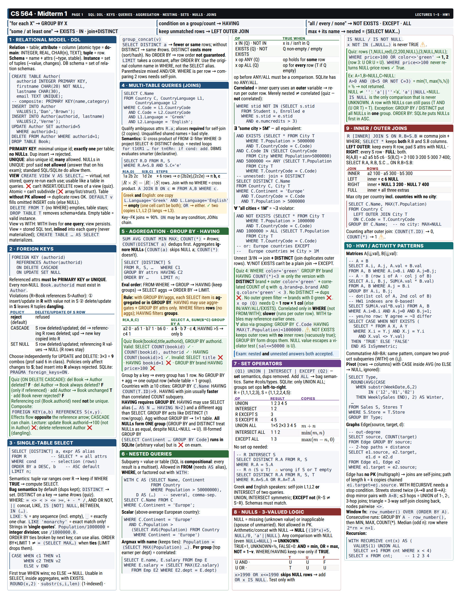
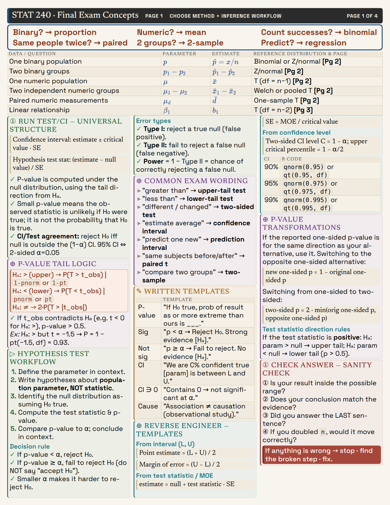

# cheatsheet

Dense, printable exam cheat sheets from a single JSON file. One React renderer drives the
browser editor, the headless checker, screenshots and PDF export, so if `check` is clean the
PDF prints exactly as shown.

<p align="center">
  
  
</p>

## Features

- **Newspaper flow layout.** Blocks fill columns in order and text breaks across columns
  between lines. Headings never strand at a column bottom; tables, callouts and diagrams never split.
- **`page.fill`.** Scales every flowed font by one factor until the pages are exactly full. No whitespace.
- **Tiny text that prints.** Layout is scale-invariant, and KaTeX is laid out large and scaled
  down, so 0.5pt text comes out crisp in the PDF.
- **Markdown + math + diagrams.** GFM tables, callouts (`> [!warn]`, `[!ok]`, `[!bad]`, …),
  KaTeX, Mermaid and Excalidraw drawings, SVG and images.
- **Themes.** `clean`, `editorial` (parchment, serif small caps, pastel cards) and `swiss`
  (condensed type, accent bands, booktabs tables).
- **Agent-friendly checker.** `check` reports every box in mm, overflow (quoting the culprit
  formula), overlaps, render errors, fill % and free space. `shot` renders zoomed PNGs with an mm grid.
- **Visual editor.** Reorder, pin and drag blocks, and edit Excalidraw drawings in the
  browser. Changes are written back to the JSON, and it live-reloads when the file changes.

## Setup

Requires Node 22+.

```sh
npm install
npx playwright install chromium
```

## Usage

```sh
./sheet init mysheet --pages 2 --size letter --columns 4   # creates sheets/mysheet.json
./sheet dev mysheet                                        # editor at http://localhost:5173/?sheet=mysheet
./sheet check mysheet                                      # validate + headless render report
./sheet shot mysheet --page 1 --clean                      # PNG in out/
./sheet set mysheet bayes style.fontSize=2.5               # edit one element
./sheet pdf mysheet                                        # out/mysheet.pdf
```

Run `./sheet <cmd> --help` for all options.

A sheet is an ordered list of blocks:

```json
{
  "theme": "swiss",
  "page": { "size": "a4", "count": 1, "fill": true },
  "guides": { "columns": 4 },
  "elements": [
    { "id": "title", "type": "text", "span": "all", "md": "# Probability — Final" },
    { "id": "bayes", "type": "text", "md": "## Basics\n**Bayes** $P(A|B)=\\frac{P(B|A)P(A)}{P(B)}$" },
    { "id": "mc", "type": "mermaid", "style": { "fontSize": 3 }, "src": "graph LR; A-->|p|B; B-->|q|A" }
  ]
}
```

Element types: `text` (markdown), `latex`, `mermaid`, `excalidraw`, `svg`, `image`. Blocks
can be flowed (the default), pinned (`x`/`y`/`w` in mm), or stacked `below` a pinned block.

The full format and design guide is in [CLAUDE.md](CLAUDE.md). It is written as instructions
for an AI agent (Claude Code), which can read your course material from `materials/` and build
the sheet end to end. Example sheets are in [`sheets/`](sheets).

## Development

```sh
npm run typecheck
```

`src/schema.ts` is the sheet format (zod), `src/render/` the layout engine and renderer,
`src/editor/` the browser editor, and `src/cli.ts` the CLI.

## License

[MIT](LICENSE)
